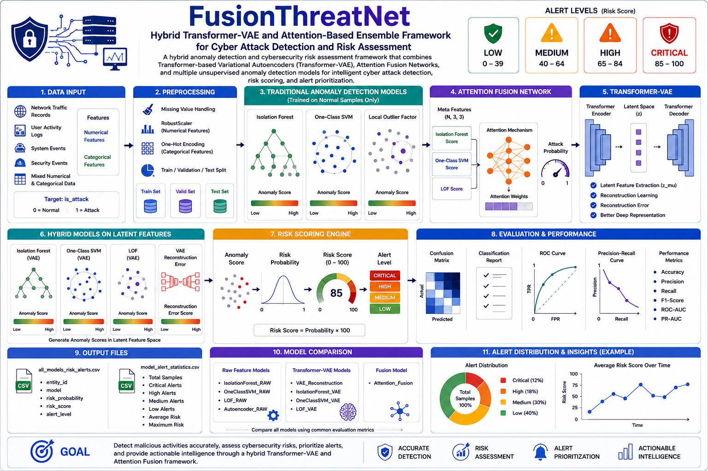
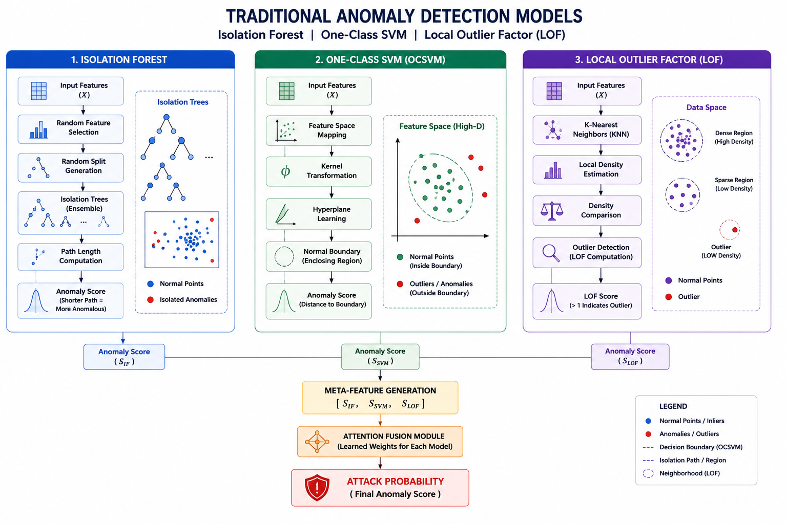
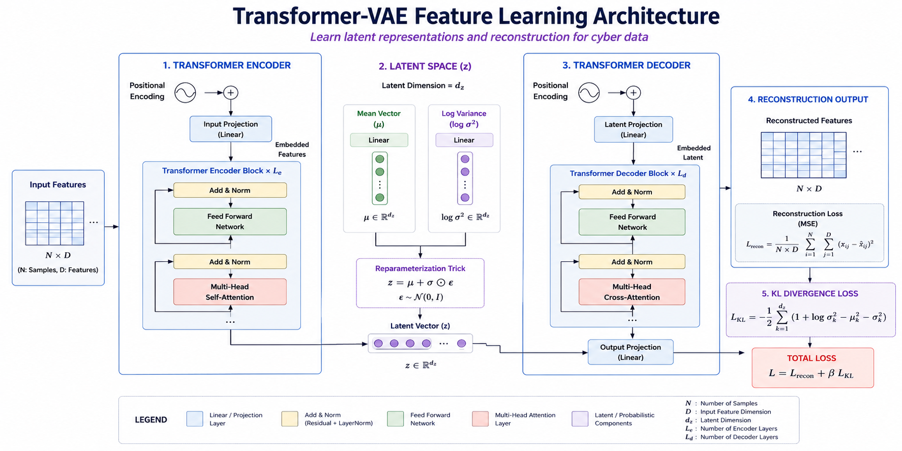

# FusionThreatNet
A hybrid cybersecurity framework integrating Transformer-based Variational Autoencoders, attention-driven ensemble learning, and unsupervised anomaly detection for attack detection, risk assessment, and alert generation.

# FusionThreatNet

> **Guided by Prof. Panigrahi Srikanth**
> Department of Artificial Intelligence and Machine Learning (AI & ML)

A hybrid anomaly detection and cybersecurity risk assessment framework that combines Transformer-based Variational Autoencoders (Transformer-VAE), Attention Fusion Networks, and multiple unsupervised anomaly detection models for intelligent cyber attack detection, risk scoring, and alert prioritization.

<p align="center">
  
</p>

<h1 align="center">FusionThreatNet</h1>

<h3 align="center">
Hybrid Transformer-VAE and Attention-Based Ensemble Framework for Cyber Attack Detection and Risk Assessment
</h3>

<p align="center">
  
  
  
  
</p>

---

## Overview

FusionThreatNet is a hybrid anomaly detection framework designed to identify malicious activities and abnormal behavioral patterns in cybersecurity environments.

The framework integrates:

* Transformer-Based Variational Autoencoder (VAE)
* Attention Fusion Network
* Isolation Forest
* One-Class Support Vector Machine (OCSVM)
* Local Outlier Factor (LOF)
* Latent Space Feature Learning
* Reconstruction Error Analysis
* Risk Scoring Engine
* Alert Prioritization System
* Ensemble-Based Anomaly Detection

The proposed framework combines deep representation learning with traditional anomaly detection techniques to improve attack detection, risk estimation, and decision support for cybersecurity monitoring systems.

---

## Dataset Information

The framework operates on structured cybersecurity datasets containing:

* Network Traffic Records
* User Activity Logs
* Security Events
* System Monitoring Data
* Mixed Numerical and Categorical Features

Due to privacy and security considerations, datasets are not included in this repository.

---

## Traditional Anomaly Detection Models

<p align="center">
  
</p>

The framework evaluates multiple unsupervised anomaly detection algorithms:

* Isolation Forest
* One-Class SVM
* Local Outlier Factor (LOF)

Each model generates anomaly scores that are subsequently fused through an attention-based ensemble mechanism.

---

## Transformer-VAE Feature Learning

<p align="center">
  
</p>

The Transformer-based Variational Autoencoder learns latent representations from cybersecurity data while preserving long-range feature dependencies.

Key components:

* Transformer Encoder
* Variational Latent Space
* Transformer Decoder
* Reconstruction Error Analysis

---

## Proposed Architecture

<p align="center">
  
</p>

The proposed FusionThreatNet architecture consists of:

1. Data Preprocessing
2. Traditional Anomaly Detection
3. Attention-Based Fusion
4. Transformer-VAE Feature Learning
5. Latent Space Anomaly Detection
6. Risk Scoring Engine
7. Alert Generation and Prioritization

---

## Workflow Pipeline

<p align="center">
  
</p>

### Pipeline Overview

```text
Input Data
      │
      ▼
Data Preprocessing
      │
      ▼
Isolation Forest
One-Class SVM
LOF
      │
      ▼
Attention Fusion Network
      │
      ▼
Attack Probability
      │
      ▼
Transformer-VAE
      │
      ▼
Latent Features
      │
      ▼
Hybrid Anomaly Detection
      │
      ▼
Risk Scoring
      │
      ▼
Alert Generation
```

---

## Risk Scoring Strategy

The framework converts anomaly scores into actionable cybersecurity intelligence.

### Risk Score

```text
Risk Score = Probability × 100
```

### Alert Levels

| Alert Level | Risk Score Range |
| ----------- | ---------------- |
| LOW         | 0 – 39           |
| MEDIUM      | 40 – 64          |
| HIGH        | 65 – 84          |
| CRITICAL    | 85 – 100         |

---

## Evaluation Metrics

The framework evaluates performance using:

* Accuracy
* Precision
* Recall
* F1-Score
* ROC-AUC
* PR-AUC
* Confusion Matrix
* Classification Report

---

## Output Files

### all_models_risk_alerts.csv

Contains:

* entity_id
* model
* risk_probability
* risk_score
* alert_level

### model_alert_statistics.csv

Contains:

* Total Samples
* Critical Alerts
* High Alerts
* Medium Alerts
* Low Alerts
* Average Risk
* Maximum Risk

---

## Project Structure

```bash
FusionThreatNet/
│
├── assets/
│   ├── interface.png
│   ├── architecture.png
│   ├── workflow.png
│   ├── transformer_vae.png
│   └── anomaly_models.png
│
├── datasets/
│
├── checkpoints/
├── notebooks/
├── src/
│
├── outputs/
│
├── train.py
├── evaluate.py
├── inference.py
│
├── requirements.txt
├── setup.py
├── .gitignore
├── LICENSE
└── README.md
```

---

## Technologies Used

* Python
* PyTorch
* TensorFlow
* NumPy
* Pandas
* Scikit-Learn
* Transformer Networks
* Variational Autoencoders
* Attention Mechanisms
* Cybersecurity Analytics
* Anomaly Detection
* Risk Assessment

---

## Key Features

* Transformer-Based Variational Autoencoder
* Attention-Based Ensemble Fusion
* Isolation Forest Integration
* One-Class SVM Integration
* Local Outlier Factor Integration
* Latent Space Feature Learning
* Reconstruction Error Analysis
* Risk Probability Estimation
* Alert Prioritization Framework
* Explainable Risk Scoring

---

## Why FusionThreatNet?

Modern cybersecurity environments generate massive volumes of heterogeneous data where malicious activities are often rare, evolving, and difficult to identify using traditional rule-based systems.

FusionThreatNet addresses these challenges through a hybrid learning strategy that combines Transformer-VAE representation learning with multiple anomaly detection algorithms and attention-guided ensemble fusion. The framework not only detects attacks but also quantifies risk and prioritizes alerts, enabling more effective security monitoring and decision-making.

---

## Goal

Detect malicious activities accurately, assess cybersecurity risks, prioritize alerts, and provide actionable intelligence through a hybrid Transformer-VAE and Attention Fusion framework.
